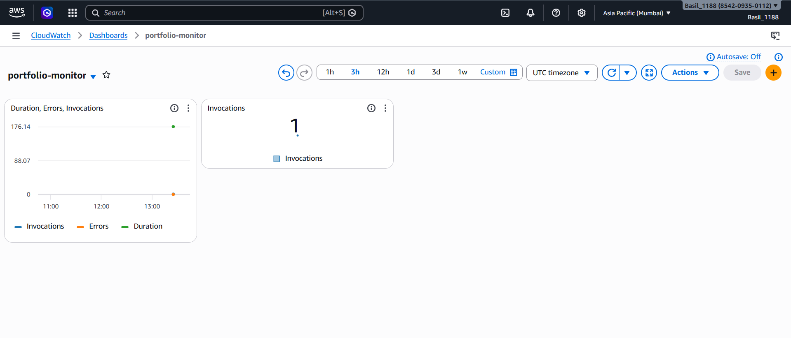

# Serverless Portfolio with Contact Form — AWS

🌐 **Live Site:** https://d1ciiv3x1cw79m.cloudfront.net

---

## What This Is

A fully serverless portfolio website with a working contact form. Built on AWS Free Tier. Auto-deployed via GitHub Actions CI/CD on every push to main.

---

## AWS Services Used

| Service | Role |
|---------|------|
| S3 | Hosts static frontend with versioning |
| CloudFront | HTTPS + global CDN — 400+ edge locations |
| API Gateway | REST endpoint — POST /contact |
| Lambda | Python backend — processes form and sends email |
| SES | Sends real email on form submission |
| IAM | Least-privilege execution role |
| CloudWatch | Monitors invocations, errors, duration |

---

## Architecture

User → CloudFront → S3 (Frontend)
Form Submit → API Gateway → Lambda → SES → Email
GitHub Push → GitHub Actions → S3 Sync → CloudFront Invalidation
---

## Key Features

- ✅ Working contact form — sends real emails via SES
- ✅ HTTPS via CloudFront CDN
- ✅ CORS configured on Lambda and API Gateway
- ✅ IAM least-privilege permissions
- ✅ CloudWatch dashboard + SNS error alarm
- ✅ GitHub Actions CI/CD — live in 60 seconds on every push

---

## CloudWatch Monitoring

---

## Author

**Basil MK** — MCA Graduate | Cloud & DevOps Engineer

---

## Architecture
